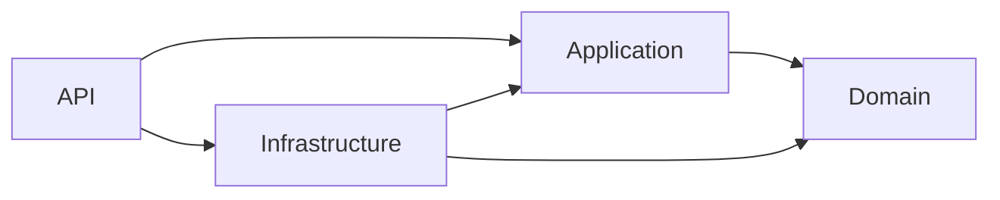
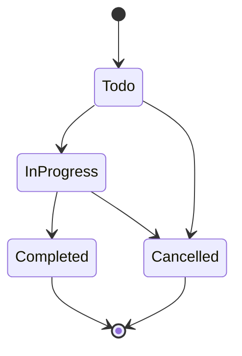

# TaskManagement API

A RESTful **Task Management API** built with **ASP.NET Core (.NET 9)** using **Clean Architecture** and **CQRS**.

Users can register, organize their work into **projects**, break each project down into **tasks**, and discuss tasks through **comments**. Everything is secured with JWT authentication and resource-level authorization, so users only manage what they own.


---

## Table of Contents

- [Project Idea](#project-idea)
- [Features](#features)
- [Technologies and Services Used](#technologies-and-services-used)
- [Architecture](#architecture)
- [API Overview](#api-overview)
- [Business Rules](#business-rules)
- [Error Handling](#error-handling)
- [Background Jobs](#background-jobs)
- [Project Structure](#project-structure)

---

## Project Idea

The system models a simple work-management workflow:

1. A **user** creates an account and logs in.
2. The user creates **projects** (for example, "Website Redesign").
3. Each project contains **tasks** that move through a defined status workflow (`Todo → InProgress → Completed`).
4. Each task has **comments** where the discussion happens.

Every resource belongs to the user who created it. Only that user (or an Admin) can modify or delete it.

## Features

### Authentication and authorization
- Register and login with **JWT access tokens**.
- **Refresh tokens** stored server-side: refreshing issues a new token pair, and logout revokes the refresh token.
- **Role-based access** with two roles: `Admin` and `User`.
- **Resource-owner policies**: only the creator of a project, task or comment (or an Admin) can modify or delete it.

### Core functionality
- **Projects, tasks and comments** with full CRUD.
- **Task status workflow** enforced in the domain layer, so invalid transitions are rejected.
- **Soft delete** with cascading (project → tasks → comments) using global EF Core query filters.

### Application design
- **CQRS with MediatR**: every use case is a separate command or query with its own handler.
- **Pipeline behaviors** for cross-cutting concerns: **logging** and **validation** (FluentValidation) run automatically around every request.
- **Result pattern**: expected failures (not found, forbidden, conflict, validation) are returned as values instead of thrown as exceptions.
- **Global exception handling** middleware that returns standard `application/problem+json` responses.

### Operations and documentation
- **Hangfire** background job that cleans up expired refresh tokens, with a protected dashboard.
- **Swagger / OpenAPI** documentation for every endpoint.

## Technologies and Services Used

| Technology | What it is used for in this project |
| --- | --- |
| **ASP.NET Core Web API (.NET 9)** | The web framework. Hosts the controllers, middleware and dependency injection. |
| **Entity Framework Core 9** | ORM for data access. Handles mappings, migrations, global query filters (soft delete) and the two `DbContext`s. |
| **SQL Server** | The database. Stores domain data, Identity data and Hangfire jobs. |
| **ASP.NET Core Identity** | User and role management: password hashing, users, roles and refresh token storage. |
| **JWT Bearer authentication** | Issues and validates access tokens so protected endpoints know who the caller is. |
| **MediatR** | Implements CQRS. Controllers send commands and queries, and MediatR routes them to the right handlers. |
| **FluentValidation** | Validates every command and query before its handler runs (through a MediatR pipeline behavior). |
| **AutoMapper** | Maps between entities and DTOs. |
| **Hangfire** (SQL Server storage) | Runs the recurring background job for refresh token cleanup and provides the dashboard. |
| **Swashbuckle (Swagger UI)** | Generates the interactive API documentation. |

### Custom services built in the project
- **JWT token service** (Infrastructure): creates access tokens and refresh tokens.
- **Repositories and Unit of Work** (Infrastructure): abstract data access behind interfaces defined in the Application layer.
- **Authorization handlers** (Application): enforce the "owner or Admin" rule on projects, tasks and comments.
- **Pipeline behaviors** (Application): logging and validation.
- **`ExceptionHandlingMiddleware`** (API): central error handling.
- **Refresh token cleanup job** (Infrastructure): the Hangfire recurring job.

## Architecture

The solution follows **Clean Architecture**. Dependencies point inward, so the `Domain` layer knows nothing about the outside world.



| Layer | Responsibility |
| --- | --- |
| **Domain** | Entities (`Project`, `Task`, `Comment`), enums, domain rules (status transitions, soft delete) and domain exceptions. No external dependencies. |
| **Application** | Use cases as MediatR commands and queries, handlers, validators, DTOs, repository and service contracts, pipeline behaviors, authorization handlers and the `Result` type. |
| **Infrastructure** | EF Core `DbContext`s, configurations and migrations, repository and Unit of Work implementations, Identity, the JWT token service and Hangfire jobs. |
| **API** | Controllers, middleware, dependency injection composition, Swagger and startup configuration. |

**Two databases** are used: one for the domain data (`AppDbContext`) and one for Identity and Hangfire (`IdentityAppDbContext`).

## API Overview

All routes are prefixed with `/api`. Protected endpoints require the header `Authorization: Bearer <access_token>`.

### Authentication

| Method | Endpoint | Description | Auth |
| --- | --- | --- | --- |
| `POST` | `/api/Authentication/Register` | Create an account (assigned the `User` role). | Public |
| `POST` | `/api/Authentication/Login` | Log in and receive an access token and a refresh token. | Public |
| `POST` | `/api/Authentication/refresh` | Exchange a refresh token for a new token pair. | Public |
| `POST` | `/api/Authentication/logout` | Revoke a refresh token. | Refresh token in body |

### Projects

| Method | Endpoint | Description |
| --- | --- | --- |
| `POST` | `/api/Projects` | Create a project. |
| `GET` | `/api/Projects` | List the current user's projects. |
| `GET` | `/api/Projects/{id}` | Get a project by id. |
| `PUT` | `/api/Projects/{id}` | Update a project (owner or Admin). |
| `DELETE` | `/api/Projects/{id}` | Soft-delete a project and its tasks (owner or Admin). |

### Tasks

| Method | Endpoint | Description |
| --- | --- | --- |
| `POST` | `/api/Tasks` | Create a task inside a project. |
| `GET` | `/api/Tasks` | List the current user's tasks. |
| `GET` | `/api/Tasks/{id}` | Get a task by id. |
| `PUT` | `/api/Tasks/{id}` | Update a task (owner or Admin, task must be open). |
| `PATCH` | `/api/Tasks/{id}/status` | Change the task status (validated transition). |
| `DELETE` | `/api/Tasks/{id}` | Soft-delete a task and its comments (owner or Admin). |

### Comments

| Method | Endpoint | Description |
| --- | --- | --- |
| `POST` | `/api/Comments` | Add a comment to an open task. |
| `GET` | `/api/Comments/task/{taskId}` | List the comments of a task. |
| `DELETE` | `/api/Comments/{id}` | Soft-delete a comment (owner or Admin). |

## Business Rules

**Task status workflow**



- `Completed` and `Cancelled` are final states. A closed task **cannot be edited or commented on**.
- Project statuses: `Pending`, `Planning`, `InProgress`, `Completed`, `Cancelled`, `Archived`.
- A project that is `Cancelled` or `Archived` **cannot receive new tasks**.
- Deleting is **soft**: records are flagged (`IsDeleted`, `DeletedAt`) and hidden by global query filters. Deleting a project cascades to its tasks and their comments.
- Only the **creator** of a project, task or comment (or an **Admin**) can modify or delete it.
- New accounts get the `User` role. The `Admin` role is not assignable through the API and must be granted directly in the Identity database.
- The `Admin` and `User` roles are seeded automatically on startup.

## Error Handling

Errors are returned as [RFC 7807](https://datatracker.ietf.org/doc/html/rfc7807) problem details.

| Error type | HTTP status |
| --- | --- |
| Validation | `400 Bad Request` |
| Unauthorized / Invalid credentials | `401 Unauthorized` |
| Forbidden | `403 Forbidden` |
| Not found | `404 Not Found` |
| Conflict (e.g. duplicate email, invalid status transition) | `409 Conflict` |
| Unexpected | `500 Internal Server Error` |

Expected failures flow through the `Result` type in the application layer and are mapped to HTTP responses by the base controller. Domain exceptions and anything unexpected are handled centrally by `ExceptionHandlingMiddleware`.

## Background Jobs

[Hangfire](https://www.hangfire.io/) runs a **daily recurring job** (`cleanup-expired-refresh-tokens`) that deletes expired and inactive refresh tokens, so the token table doesn't grow forever.

The dashboard is available at `/hangfire`:

- **Development:** open to everyone.
- **Other environments:** authenticated users in the `Admin` role only.

## Project Structure

```text
TaskManagement/
├── API/                      # Controllers, middleware, Program.cs
│   ├── Controllers/
│   ├── HangFireAuthorization/
│   └── Middlewares/
├── Application/              # Use cases and contracts
│   ├── Behaviors/            # Logging and validation pipeline
│   ├── Common/               # Authorization, Result pattern, mappings, identity abstractions
│   ├── Contracts/            # Repository and service interfaces
│   └── Features/             # Authentication, Projects, Tasks, Comments
│       └── <Feature>/{Commands,Queries,DTOs}
├── Domain/                   # Entities, enums, domain exceptions
├── Infrastructure/           # EF Core, Identity, repositories, Hangfire jobs
│   ├── BackgroundJobs/
│   ├── Identity/
│   ├── Migrations/
│   ├── Persistence/
│   └── Repositories/
├── global.json
└── TaskManagement.sln
```
