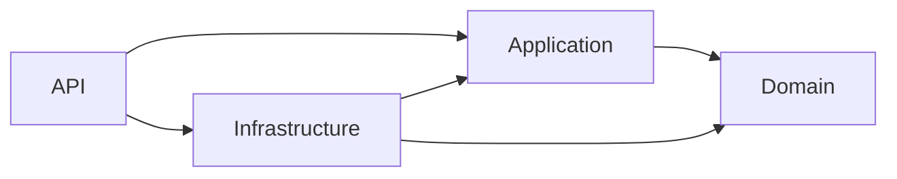
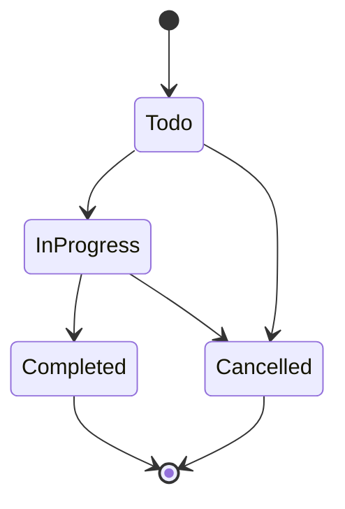

# TaskManagement

A RESTful **Task Management API** built with **ASP.NET Core (.NET 9)** using **Clean Architecture** and **CQRS**. Users can register, organize their work into **projects**, break projects down into **tasks**, and discuss tasks through **comments**, all secured with JWT authentication and resource-level authorization.


---

## Table of Contents

- [Features](#features)
- [Tech Stack](#tech-stack)
- [Architecture](#architecture)
- [Getting Started](#getting-started)
- [Configuration](#configuration)
- [API Overview](#api-overview)
- [Business Rules](#business-rules)
- [Error Handling](#error-handling)
- [Background Jobs](#background-jobs)
- [Project Structure](#project-structure)

---

## Features

- **Authentication and authorization**
  - Register / login with JWT access tokens
  - Refresh tokens stored server-side: refreshing issues a new token pair, and logout revokes the refresh token
  - Role-based access (`Admin`, `User`) plus **resource-owner policies**: only the creator of a resource (or an Admin) can modify or delete it
- **Projects, tasks and comments** with full CRUD
- **Task status workflow** enforced in the domain layer (invalid transitions are rejected)
- **Soft delete** with cascading (project → tasks → comments) and global EF Core query filters
- **CQRS with MediatR**, including pipeline behaviors for **logging** and **validation** (FluentValidation)
- **Result pattern** for predictable, exception-free error flow in the application layer
- **Global exception handling** middleware returning standard `application/problem+json` responses
- **Hangfire** background job for cleaning up expired refresh tokens, with a protected dashboard
- **Swagger / OpenAPI** documentation out of the box

## Tech Stack

| Area | Technology |
| --- | --- |
| Framework | ASP.NET Core Web API, .NET 9 |
| ORM | Entity Framework Core 9 (SQL Server) |
| Auth | ASP.NET Core Identity, JWT Bearer |
| CQRS / Mediator | MediatR |
| Validation | FluentValidation |
| Mapping | AutoMapper |
| Background jobs | Hangfire (SQL Server storage) |
| API docs | Swashbuckle (Swagger UI) |

## Architecture

The solution follows **Clean Architecture**. Dependencies point inward: the `Domain` layer knows nothing about the outside world.



| Layer | Responsibility |
| --- | --- |
| **Domain** | Entities (`Project`, `Task`, `Comment`), enums, domain rules (status transitions, soft delete) and domain exceptions. No external dependencies. |
| **Application** | Use cases as MediatR commands/queries, handlers, validators, DTOs, repository and service contracts, pipeline behaviors, authorization handlers, `Result` type. |
| **Infrastructure** | EF Core `DbContext`s, configurations and migrations, repository and Unit of Work implementations, Identity, JWT token service, Hangfire jobs. |
| **API** | Controllers, middleware, DI composition, Swagger and startup configuration. |

Two databases are used: one for the domain data (`AppDbContext`) and one for Identity and Hangfire (`IdentityAppDbContext`).

## Getting Started

### Prerequisites

- [.NET 9 SDK](https://dotnet.microsoft.com/download/dotnet/9.0)
- SQL Server (LocalDB, Express, Developer edition, or Docker)
- The EF Core CLI tool:

  ```bash
  dotnet tool install --global dotnet-ef
  ```

### 1. Clone the repository

```bash
git clone https://github.com/YOUR_USERNAME/TaskManagement.git
cd TaskManagement
```

### 2. Configure the application

`appsettings.Development.json` is git-ignored, so create `API/appsettings.Development.json` yourself. See [Configuration](#configuration) for the full template.

### 3. Apply the database migrations

Run both commands from the solution root:

```bash
dotnet ef database update --project Infrastructure --startup-project API --context AppDbContext
dotnet ef database update --project Infrastructure --startup-project API --context IdentityAppDbContext
```

### 4. Run the API

```bash
dotnet run --project API
```

The API starts at `http://localhost:5280` (or `https://localhost:7066` with the `https` profile) and opens **Swagger UI** at `/swagger`.

On startup the app seeds the `Admin` and `User` roles automatically.

## Configuration

Create `API/appsettings.Development.json`:

```json
{
  "ConnectionStrings": {
    "DefaultConnection": "Server=.;Database=TaskManagementSystem;Trusted_Connection=true;TrustServerCertificate=true",
    "IdentityConnection": "Server=.;Database=IdentityTaskManagementSystem;Trusted_Connection=true;TrustServerCertificate=true"
  },
  "JWT": {
    "SecretKey": "REPLACE_WITH_A_RANDOM_SECRET_AT_LEAST_32_CHARACTERS",
    "Issuer": "http://localhost:5280",
    "Audience": "http://localhost:5280/api",
    "ExpirationMinutes": "30"
  }
}
```

| Key | Description |
| --- | --- |
| `ConnectionStrings:DefaultConnection` | Database for projects, tasks and comments. |
| `ConnectionStrings:IdentityConnection` | Database for users, roles, refresh tokens and Hangfire. |
| `JWT:SecretKey` | Signing key. **Must be at least 32 characters** or token creation fails. |
| `JWT:Issuer` / `JWT:Audience` | Validated on every request. |
| `JWT:ExpirationMinutes` | Access token lifetime. |

> **Security:** never commit real secrets. For local development prefer [.NET user secrets](https://learn.microsoft.com/aspnet/core/security/app-secrets) (`dotnet user-secrets set "JWT:SecretKey" "..." --project API`), and use environment variables or a secret manager in production.

## API Overview

All routes are prefixed with `/api`. Protected endpoints require the header `Authorization: Bearer <access_token>`. Full request and response schemas are available in Swagger UI.

### Authentication

| Method | Endpoint | Description | Auth |
| --- | --- | --- | --- |
| `POST` | `/api/Authentication/Register` | Create an account (assigned the `User` role). | Public |
| `POST` | `/api/Authentication/Login` | Log in and receive an access token + refresh token. | Public |
| `POST` | `/api/Authentication/refresh` | Exchange a refresh token for a new token pair. | Public |
| `POST` | `/api/Authentication/logout` | Revoke a refresh token. | Refresh token in body |

### Projects

| Method | Endpoint | Description |
| --- | --- | --- |
| `POST` | `/api/Projects` | Create a project. |
| `GET` | `/api/Projects` | List the current user's projects. |
| `GET` | `/api/Projects/{id}` | Get a project by id. |
| `PUT` | `/api/Projects/{id}` | Update a project (owner or Admin). |
| `DELETE` | `/api/Projects/{id}` | Soft-delete a project and its tasks (owner or Admin). |

### Tasks

| Method | Endpoint | Description |
| --- | --- | --- |
| `POST` | `/api/Tasks` | Create a task inside a project. |
| `GET` | `/api/Tasks` | List the current user's tasks. |
| `GET` | `/api/Tasks/{id}` | Get a task by id. |
| `PUT` | `/api/Tasks/{id}` | Update a task (owner or Admin, task must be open). |
| `PATCH` | `/api/Tasks/{id}/status` | Change the task status (validated transition). |
| `DELETE` | `/api/Tasks/{id}` | Soft-delete a task and its comments (owner or Admin). |

### Comments

| Method | Endpoint | Description |
| --- | --- | --- |
| `POST` | `/api/Comments` | Add a comment to an open task. |
| `GET` | `/api/Comments/task/{taskId}` | List comments of a task. |
| `DELETE` | `/api/Comments/{id}` | Soft-delete a comment (owner or Admin). |

### Example: register and create a project

```http
POST /api/Authentication/Register
Content-Type: application/json

{
  "userName": "jane",
  "email": "jane@example.com",
  "password": "Str0ngPass!"
}
```

```http
POST /api/Projects
Authorization: Bearer <access_token>
Content-Type: application/json

{
  "name": "Website Redesign",
  "description": "Redesign the marketing website",
  "status": "Planning"
}
```

## Business Rules

**Task status workflow**



- `Completed` and `Cancelled` are final states. A closed task **cannot be edited or commented on**.
- Project statuses: `Pending`, `Planning`, `InProgress`, `Completed`, `Cancelled`, `Archived`.
- A project that is `Cancelled` or `Archived` **cannot receive new tasks**.
- Deleting is **soft**: records are flagged (`IsDeleted`, `DeletedAt`) and hidden by global query filters. Deleting a project cascades to its tasks and their comments.
- Only the **creator** of a project, task or comment (or an **Admin**) can modify or delete it.
- New accounts get the `User` role. The `Admin` role is not assignable through the API and must be granted directly in the Identity database.

## Error Handling

Errors are returned as [RFC 7807](https://datatracker.ietf.org/doc/html/rfc7807) problem details.

| Error type | HTTP status |
| --- | --- |
| Validation | `400 Bad Request` |
| Unauthorized / Invalid credentials | `401 Unauthorized` |
| Forbidden | `403 Forbidden` |
| Not found | `404 Not Found` |
| Conflict (e.g. duplicate email, invalid status transition) | `409 Conflict` |
| Unexpected | `500 Internal Server Error` |

Expected failures flow through the `Result` type in the application layer and are mapped to HTTP responses by the base controller. Domain exceptions and anything unexpected are handled centrally by `ExceptionHandlingMiddleware`.

## Background Jobs

[Hangfire](https://www.hangfire.io/) runs a **daily recurring job** (`cleanup-expired-refresh-tokens`) that deletes expired and inactive refresh tokens.

The dashboard is available at `/hangfire`:

- **Development:** open to everyone.
- **Other environments:** authenticated users in the `Admin` role only.

## Project Structure

```text
TaskManagement/
├── API/                      # Controllers, middleware, Program.cs
│   ├── Controllers/
│   ├── HangFireAuthorization/
│   └── Middlewares/
├── Application/              # Use cases and contracts
│   ├── Behaviors/            # Logging and validation pipeline
│   ├── Common/               # Authorization, Result pattern, mappings, identity abstractions
│   ├── Contracts/            # Repository and service interfaces
│   └── Features/             # Authentication, Projects, Tasks, Comments
│       └── <Feature>/{Commands,Queries,DTOs}
├── Domain/                   # Entities, enums, domain exceptions
├── Infrastructure/           # EF Core, Identity, repositories, Hangfire jobs
│   ├── BackgroundJobs/
│   ├── Identity/
│   ├── Migrations/
│   ├── Persistence/
│   └── Repositories/
├── global.json
└── TaskManagement.sln
```
